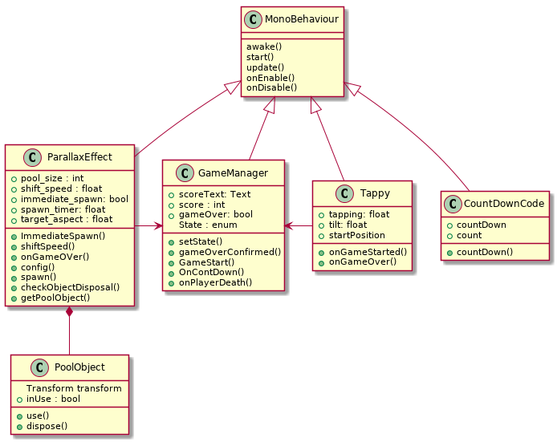
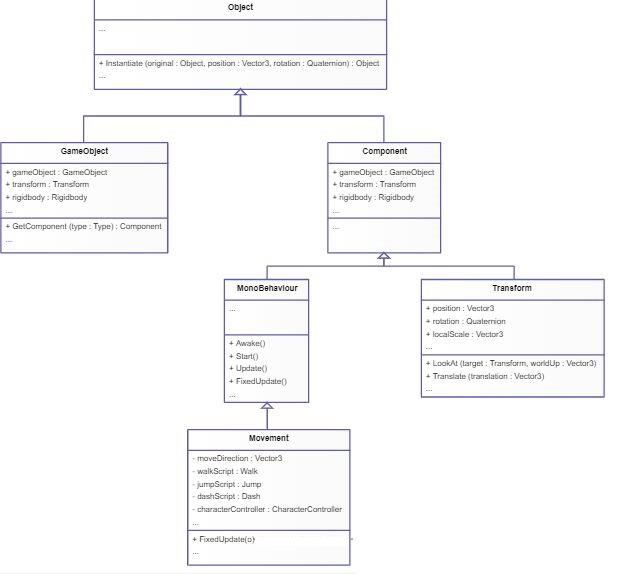
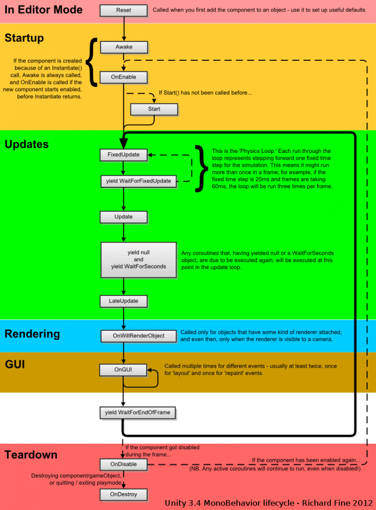

#### FlyButterFly2D  Class Diagramı

Not: MonoBehaviour, her Unity scriptinin türetildiği temel sınıftır.
Start fonksiyonun içindeki kodlar herhangi bir update işlemi gerçekleşmeden ve sahne objeleri henüz oluşturmadan önce çalışacak olan kodlardır. Awake fonksiyonundan sonra çalışır. Update fonksiyonu ise devamlı çalışan güncelleme fonksiyonudur.

[source, plantUml]
----
@startuml

class MonoBehaviour{
  
  awake()
  start()
  update()
  onEnable()
  onDisable() 

  
}
class Tappy{
  +tapping: float
  +tilt: float
  +startPosition 
  +onGameStarted()
  +onGameOver()
}
class GameManager{
  +scoreText: Text
  +score : int
  + gameOver: bool
  State : enum 
  +setState()
  +gameOverConfirmed()
  +GameStart()
  +OnContDown()
  +onPlayerDeath()
}
class ParallaxEffect{
  +pool_size : int
  +shift_speed : float
  +immediate_spawn: bool
  +spawn_timer: float
  +target_aspect : float
  +ImmediateSpawn()
  +shiftSpeed()
  +onGameOVer()
  +config()
  +spawn()
  +checkObjectDisposal()
  +getPoolObject()
  }
class PoolObject{
  Transform transform
  +inUse : bool
  +use()
  +dispose()
}

class CountDownCode{
  +countDown
  +count
  +countDown()
}
MonoBehaviour <|-down- GameManager 
MonoBehaviour <|-down- Tappy
MonoBehaviour <|-down- ParallaxEffect
MonoBehaviour <|-down- CountDownCode
ParallaxEffect *-down- PoolObject
ParallaxEffect -> GameManager
Tappy -left> GameManager

@enduml
----

*UnitiEngine hierarchy*

UnityEngine.Object -> UnityEngine.ScriptableObject -> Component -> Behaviour -> MonoBehaviour

*Unity class diagramı* 

*Monobehaviour'un yaşam döngüsü*

