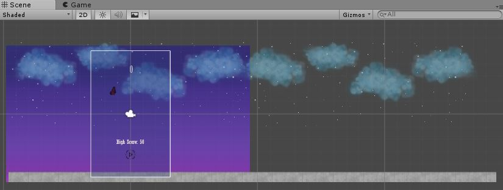

*Singleton pattern kullanımı*

Herhangi bir script GameManager (GManage) dan bir nesne yaratmaya ihtiyac duyarsa ilk seferinde yapılan yaratma işleminden sonra başka bir yaratma istense bile ilkte yaratılan nesne örneği kullansın diye Singleton Pattern. yaptığım oyunda (tek sahne var) sahne değişme 'not switching scenes' olayı olmadığından dolayı ılla Singleton olmasına gerek yok.

 
[source, C#]
----
public class GManager : MonoBehaviour {
public static GManager instance=null;
private GManager() { }

public static GManager Instance {
        get
        {
            return instance;
        }
    }
public void Awake()
    {

         if (instance == null) {instance = this;}
       
    }
    }
----
* Monobehaviourun  Awake() Metodu :
Awake: Bu fonksiyon daima Start fonksiyonundan önce çalıştırılır, ayrıca bir prefab Instantiate edildiği anda da çalıştırılır. (Eğer GameObject aktif (active) değilse bu fonksiyon obje aktif olana kadar ya da bu objedeki bir scriptte yer alan bir fonksiyon dışarıdan çağrılana kadar çalıştırılmaz.)

* Monobehaviourun  OnDestroy() Metodu :
OnDestroy: Obje yok olmadan önceki son frame’inde, tüm Update() fonksiyonları çalıştırıldıktan sonra gerçekleşir. Objenin yok olmasının sebebi Destroy metodunun kullanımı olabileceği gibi başka bir sahneye (scene) geçiş de olabilir.*Bu Oyunda OnDestroy kullanılmamaktadır, dediğim gibi tek oyuncu ve yanma olduğu zaman Replay butona basıp nesne yaratma ve sayra 0'dan başlar.*
 