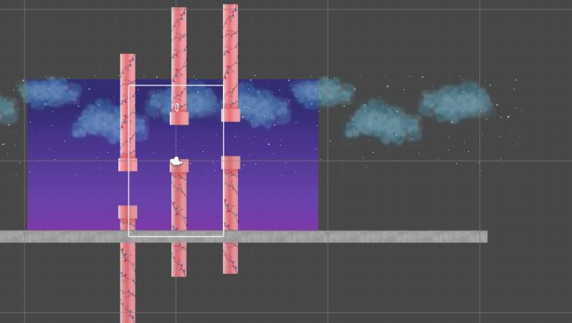
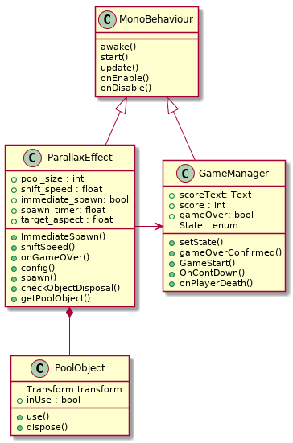

*Object Pool*

Object Pool Pattern geliştirdiğim uygulama için en önemli patterndır. 
Unity geliştirme ortamindaki Scene içinde 3 tane game object oluşturudum (Stars, Clouds ve Pipes'engeller'). Stars, Clouds ve Pipes ,oyun başladığında, x ekseninde negative doğru farklı hızlarla yuruyecek. Bu işlem kullancıya Butterfly ileri yönde gittiğini görünür.

PoolObject (PObject) sınıfı tüm nesneleri takip eder ve o nesneler kullanıp veya kullanılmaksızın sorumluluğa sahip.
İstenilen nesnelerin sürekli olarak üretilmesi yerine havuzu oluşturup ve her GameObject için farlkı sayıda nesnelerle doldurdum
Her bir nesne farkli poolsize sahip.
Object Dispose için bir PoolObbject sınıfından bir nesne alan bir metod yazdım. Yaptığı iş ise Nesne kullanımda veya kullanımda degil kontrolu yapar, eğer kullanımda değilse havuzdan dispose ediyor.
Resimede nesne ler -x ekseninde  OFFSCREEN olduğu zaman dispose ediliyor. ve kullanma zamanı geldiğinde başta spawn ediliyor.

*UMLDIAGRAM*

