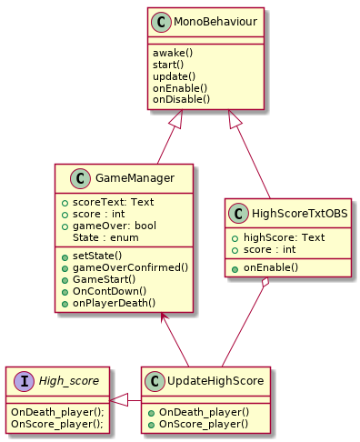

*Observer Pattern*

Observer patternı oyuna uygulayabılmek için  Butterfly her engeli geçtiği zaman bir score arttırıp rekoru kırınca bir Highscore yazdırırken ek olarak Unity'de PlayerPrefs, oyuncu için özelleştirilmiş/oyuncuya ait verileri saklamak ve daha sonra bu verilere erişmek imkanı sağlayan bir sınıfıdır. PlayerPrefs kullanarak oyuncu bir yere ulaştığı zaman bir Achievement açılıyor. örneğin 25 engel geçtiği zaman WARRIOR mesaji döndürür...

[source, plantUml]
----
@startuml

class MonoBehaviour{
  
  awake()
  start()
  update()
  onEnable()
  onDisable() 

  
}

class GameManager{
  +scoreText: Text
  +score : int
  + gameOver: bool
  State : enum 
  +setState()
  +gameOverConfirmed()
  +GameStart()
  +OnContDown()
  +onPlayerDeath()
}

class UpdateHighScore{
  +OnDeath_player()
  +OnScore_player()
  
}
class HighScoreTxtOBS{
  +highScore: Text
  +score : int
  +onEnable()

}
interface High_score{
  OnDeath_player();
 OnScore_player();
}

MonoBehaviour <|-down- GameManager 
MonoBehaviour <|-down- HighScoreTxtOBS
UpdateHighScore -up-> GameManager
HighScoreTxtOBS o-down- UpdateHighScore
High_score <|- UpdateHighScore

@enduml
----

