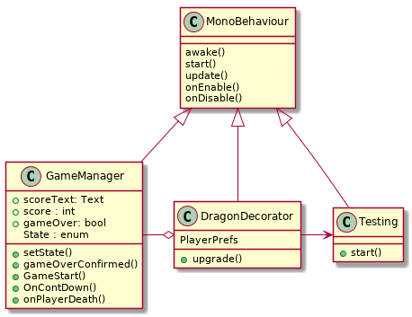

*Decorator Pattern*

[source, plantUml]
----
@startuml

class MonoBehaviour{
  
  awake()
  start()
  update()
  onEnable()
  onDisable() 

  
}

class GameManager{
  +scoreText: Text
  +score : int
  + gameOver: bool
  State : enum 
  +setState()
  +gameOverConfirmed()
  +GameStart()
  +OnContDown()
  +onPlayerDeath()
}
class Testing{
  +start()
}
class DragonDecorator{
  PlayerPrefs
  +upgrade()
}

MonoBehaviour <|-down- Testing
MonoBehaviour <|-down- GameManager 
MonoBehaviour <|-down- DragonDecorator

 DragonDecorator o-left- GameManager
DragonDecorator -> Testing

@enduml
----